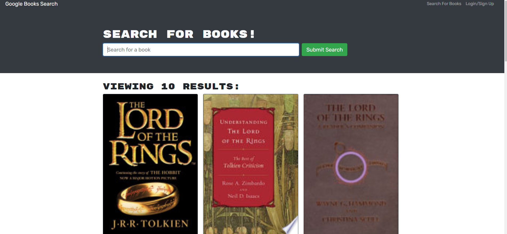

# Book Search Engine 

## Description

for this challenge i refactored existing code usting RESTful code into using apollo provider and graphQL.

## Table of Contents

- [Installation](#installation)
- [Usage](#usage)
- [License](#license)
- [Contributing](#contributing)
- [Tests](#tests)
- [Questions](#questions)

## Installation

to install the modules run `npm install` in the terminal

## Usage

run `npm run develop` to start both the back and front end

## License

No license

## Contributing

i worked with marcus paccapaniccia on the project. https://github.com/mpacct

## Tests

no test

## Questions

Github username: [nickrosales](https://www.github.com/nickrosales)

Email: nickrosales68@gmail.com

  